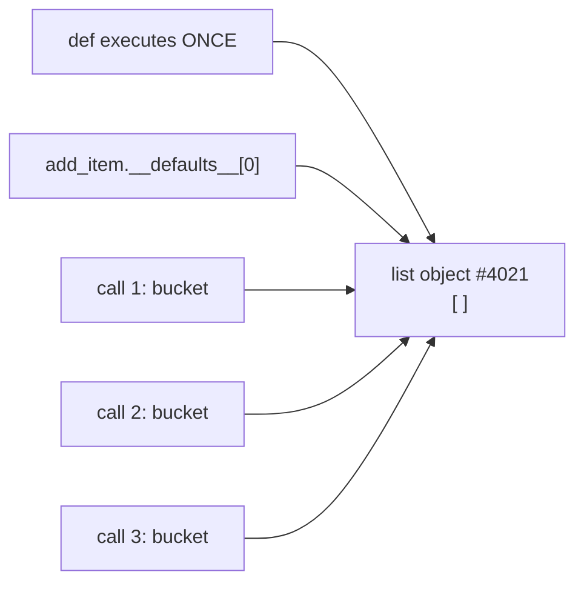
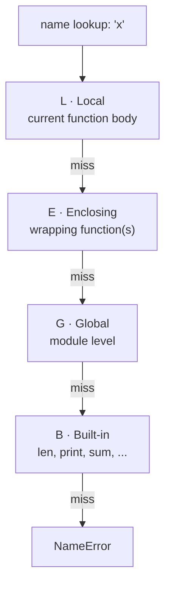

# W1D2 — Control flow, loops, functions, arguments, scope, pure functions

**Phase 1 · Week 1 · Day 2 · Mon 10 Aug 2026**
**Status: delivered as written material, not as a live session.** See `sessions/2026-08-10-w1d2.md`.

This file is the concept block written out in full so you can work it without me. It is longer than a
50-minute talk because you have to read what I would otherwise have said out loud. Budget 60–70 minutes.

---

## 0. Where this sits

Day 1 gave you the object model: **names are bindings, `=` rebinds, methods mutate.**
Today is the same model observed through a function boundary. Nothing new is being added to the
object model. What is new is *scope* — the rules that decide which object a name is currently bound to
when the interpreter reaches that line.

Every single thing in today's lesson is a consequence of two facts you already know:

1. A name is a label on an object.
2. Some objects can be changed in place; some cannot.

If a result surprises you today, you have mis-tracked a binding. Go back and draw the arrows.

---

## 1. Control flow — the short part

You know branching. Four things are genuinely different from C#.

### 1.1 There is no block scope

```python
if True:
    winner = "a"
print(winner)     # "a"  — still alive
```

In C#, `winner` would not exist outside the `if`. In Python, `if`, `for`, `while`, `try` and `with`
**do not create a scope**. Only `def`, `class`, `lambda`, and module/comprehension bodies do.

This is not sloppiness, it is a deliberate simplification: Python has function scope, not block scope.
The cost is that a name can be *conditionally undefined*:

```python
if score > 90:
    grade = "A"
print(grade)      # NameError if score <= 90 — and only then
```

That is a bug that passes every test where `score > 90` and explodes in production. In C# the compiler
would have stopped you. Python will not. **You** have to stop you. Rule: assign a default before the
branch, or make every branch assign.

### 1.2 Conditions take anything, not just `bool`

```python
if items:          # idiomatic — true when items is non-empty
if len(items) > 0: # correct but noisy
if items == True:  # wrong, and wrong in an interesting way
```

Falsy values: `False`, `None`, `0`, `0.0`, `""`, `[]`, `()`, `{}`, `set()`, and anything whose
`__len__` returns 0. Everything else is truthy.

The trap that will actually bite you in Week 4: `if df:` on a pandas DataFrame **raises**, and
`if x:` where `x` is `0` is false even though `x` exists. When "missing" and "zero" are different
things — and in ML they always are — test `if x is None:`, never `if not x:`.

### 1.3 Loops iterate over objects, not indices

```python
for row in rows:          # idiomatic
for i in range(len(rows)) # you are writing C#
```

`range(n)` is a lazy object, not a list. `range(10**12)` costs a few bytes.

### 1.4 `for ... else` exists and means something non-obvious

```python
for row in rows:
    if row.id == target:
        break
else:
    raise KeyError(target)      # runs only if the loop never hit `break`
```

Read `else` here as **"if no break"**. It is the search-failed branch. Rare, but when you meet it in
someone's code you should not have to guess.

---

## 2. Functions — the mathematical object first

Before syntax, the notation, because you will read it for the next 25 weeks.

$$f : X \rightarrow Y$$

Read: "*f* maps from *X* to *Y*". Every symbol:

| Symbol | Name | Means |
|---|---|---|
| $f$ | the function | a rule that assigns outputs to inputs |
| $X$ | the **domain** | the set of legal inputs |
| $Y$ | the **codomain** | the set the outputs live in |
| $\rightarrow$ | "maps to" | — |
| $f(x) = y$ | application | the output *f* assigns to input *x* |

The defining property of a mathematical function: **each input has exactly one output.** Give it the
same $x$ twice, you get the same $y$ twice. Always. No exceptions. That is not a style preference,
it is the definition.

Now the notation you will see constantly in ML:

$$\hat{y} = f(x; \theta)$$

| Symbol | Read as | Means |
|---|---|---|
| $\hat{y}$ | "y-hat" | the model's **prediction** (the hat means estimated, not true) |
| $y$ | "y" | the **true** value |
| $x$ | "x" | one input example (a feature vector) |
| $\theta$ | "theta" | the model's **parameters** — the numbers learned during training |
| `;` | semicolon | separates *inputs* from *parameters* |

That semicolon is the whole game. $x$ changes every call. $\theta$ is fixed once training ends.
A trained model is a function with $\theta$ frozen. **Training is the process of choosing $\theta$.**
When you eventually write `model.predict(X)`, you are calling $f(x; \theta)$ with $\theta$ already
baked in. Hold onto this; it is the sentence that makes Week 8 make sense.

### Worked numeric example

Let $f(x; \theta) = \theta_1 x + \theta_0$ — a straight line, the simplest possible model.
Fix $\theta_0 = 2$, $\theta_1 = 3$ (subscripts index the parameter list; $\theta_0$ is the intercept,
$\theta_1$ the slope).

| $x$ | computation | $\hat{y}$ |
|---|---|---|
| 0 | $3(0) + 2$ | 2 |
| 1 | $3(1) + 2$ | 5 |
| 4 | $3(4) + 2$ | 14 |
| 1 | $3(1) + 2$ | **5 again** |

That last row is the point. Same input, same output, forever. In Python:

```python
def predict(x, slope=3.0, intercept=2.0):
    return slope * x + intercept
```

This is a **pure function** and a mathematical function at the same time. Most of the Python you will
write today is not. Section 6 is about the gap.

---

## 3. Arguments — where Python and C# actually diverge

### 3.1 There is no overloading

In C# you write three methods called `Train`. In Python, `def train` written twice means the second
definition **rebinds the name** and the first is garbage. A name holds one object. A function is an
object. You already know this rule; you just haven't applied it to `def` yet.

```python
def train(data): ...
def train(data, epochs): ...
train([1,2,3])     # TypeError — only the second one exists
```

One name, one function. Everything overloading did for you, Python does with defaults and
`*args`/`**kwargs`.

### 3.2 The four kinds of parameter, in signature order

```python
def train(data, /, epochs=10, *extra, lr=0.01, **options):
    ...
```

| Part | Kind | Callable as |
|---|---|---|
| `data` | positional-only (everything left of `/`) | `train(d)` — **not** `train(data=d)` |
| `epochs=10` | positional-or-keyword, with default | `train(d, 5)` or `train(d, epochs=5)` |
| `*extra` | collects surplus positional args into a **tuple** | `train(d, 5, "a", "b")` → `extra = ("a","b")` |
| `lr=0.01` | keyword-only (anything right of `*`) | `train(d, lr=0.1)` — **never** positionally |
| `**options` | collects surplus keyword args into a **dict** | `train(d, verbose=True)` → `options = {"verbose": True}` |

The `*` separator is the useful one. `def fit(X, y, *, shuffle=True)` makes `fit(X, y, True)` a
`TypeError` and forces `fit(X, y, shuffle=True)` at every call site. Every boolean parameter in a
library you will ever import should be keyword-only, and the good ones are. A bare `True` at a call
site is unreadable and unsearchable — this is the language letting you enforce that.

**When would you use it, and what does it cost?** Use keyword-only for anything a reader can't decode
positionally: flags, tuning knobs, more than ~3 parameters. The cost is verbosity at every call site,
and it is a **breaking API change** to add `*` later — every existing positional call fails. So decide
early. That is a real architecture decision, and it is the same decision you make about method
signatures in a shipped .NET library.

### 3.3 The mutable default argument — the trap

Read the pre-read prediction you were asked to write, then read this.

```python
def add_item(item, bucket=[]):
    bucket.append(item)
    return bucket

print(add_item(1))    # [1]
print(add_item(2))    # [1, 2]      <-- not [2]
print(add_item(3))    # [1, 2, 3]   <-- not [3]
```

**Why.** Default values are evaluated **once, when the `def` statement executes** — that is, at
definition time, not at call time. The `[]` literal creates exactly one list object. That object is
stored on the function object itself, at `add_item.__defaults__[0]`. Every call that omits `bucket`
binds the parameter name to *that same object*. `.append` mutates in place. There is no second list.

Trace it against Day 1's rule:



Three call frames, three names, **one object**. `bucket.append(...)` mutates; nothing ever rebinds.
Exactly the Q7 distinction from Friday, seen through a default argument.

Prove it to yourself in the lab: `print(id(add_item()))` twice and watch the same id come back.

**The fix, and why it is written this way:**

```python
def add_item(item, bucket=None):
    if bucket is None:
        bucket = []          # a NEW list, per call, at call time
    bucket.append(item)
    return bucket
```

`None` is immutable and a singleton, so sharing it is harmless. The `if` runs per call, so the `[]`
literal is evaluated per call. Note `is None` and not `== None`: `is` compares identity, and a caller
could pass an object whose `__eq__` misbehaves. Also note this deliberately still mutates a
caller-supplied list — if the caller passes `bucket`, they get their own list back, mutated. Whether
that is a feature or a landmine is *your* API decision, and you should document which.

**Immutable defaults are fine.** `def f(x=0)`, `def f(name="")`, `def f(p=(1,2))` — nothing can mutate
them, so sharing one object across calls is unobservable. The rule is not "no defaults". The rule is
**no mutable defaults**.

---

## 4. Scope — LEGB, resolved at runtime



Two rules that cause almost all scope bugs:

**Rule 1 — reading is dynamic, but *assignment anywhere* in a function makes the name local for the
whole function.** Python decides local-vs-not by scanning the function body for assignments at
*compile* time, before a single line runs.

```python
count = 0
def bump():
    print(count)   # UnboundLocalError
    count = count + 1
```

`count = ...` appears in the body, so `count` is local for the entire function — including the `print`
that textually precedes it. It is not "not yet assigned in the global sense"; it is a *different
variable* that has no value yet. C# would resolve to the field. Python does not.

Escape hatches: `global count` (write to module scope) and `nonlocal count` (write to the nearest
enclosing *function* scope). You will need `nonlocal` occasionally for closures. You should need
`global` approximately never — if you reach for it, what you actually want is a return value or a
class.

**Rule 2 — closures capture the variable, not the value.**

```python
fns = []
for i in range(3):
    fns.append(lambda: i)
print([f() for f in fns])     # [2, 2, 2]  — not [0, 1, 2]
```

All three lambdas close over the same `i`. The loop finishes with `i == 2` (and `i` survives the loop,
because loops have no scope). Calling them later reads `i` *then*, and `i` is 2.

Fix by binding at definition time via a default argument — the very mechanism that was a trap in
§3.3 is the tool here:

```python
fns = [lambda i=i: i for i in range(3)]   # [0, 1, 2]
```

`i=i` is evaluated when the lambda is created, freezing that call's value. Same language rule,
opposite sign. That is worth sitting with for a minute: the "footgun" and the "idiom" are one
mechanism, and which one it is depends entirely on whether the default is mutable.

You will meet this exact bug in Week 14 when you build a list of layers or hooks in a loop.

---

## 5. `*args` / `**kwargs` — unpacking in both directions

The `*` and `**` symbols mean *collect* in a signature and *spread* at a call site.

```python
def log(fmt, *args, **kwargs):
    print(fmt, args, kwargs)

log("hi", 1, 2, a=3)        # hi (1, 2) {'a': 3}

params = (1, 2)
opts   = {"a": 3}
log("hi", *params, **opts)  # identical — spread
```

The honest use case, and the one you'll actually hit: **pass-through wrappers.**

```python
def timed_fit(model, *args, **kwargs):
    t0 = time.perf_counter()
    out = model.fit(*args, **kwargs)
    print(f"fit took {time.perf_counter() - t0:.2f}s")
    return out
```

`timed_fit` wraps *any* `fit` signature without knowing it. That is real leverage and there is no
clean C# equivalent.

**What it costs you — say this out loud.** `*args`/`**kwargs` erase the signature. `help()` shows
nothing useful, your IDE stops autocompleting, type checkers give up, and a typo'd keyword
(`versbose=True`) silently lands in `kwargs` and is ignored instead of raising `TypeError`. That last
one is not hypothetical — it is a top-5 cause of "why did my hyperparameter do nothing".

**Rule: use them for pass-through, not for laziness.** If you know the parameters, name them.

---

## 6. Pure functions — and why your training loop isn't one

**Definition without the word "pure":** a function whose return value depends only on its arguments,
and which changes nothing outside itself. Same inputs → same output, every time. No reads of global
state, no writes to global state, no I/O, no clock, no randomness, no mutation of its arguments.

That is exactly the mathematical function from §2. `predict(x, slope, intercept)` qualifies.

**Why an ML training loop almost never qualifies:**

| Impurity | Where it comes from |
|---|---|
| Randomness | weight initialisation, shuffling, dropout, augmentation, `train_test_split` |
| Mutation | `model` is mutated in place — `fit()` writes $\theta$ into the object it was called on |
| Hidden global state | the RNG's internal state; PyTorch's global device/dtype defaults |
| I/O and clock | reading data from disk, logging, checkpointing, early stopping on wall-clock |
| Hardware non-determinism | GPU float reductions are order-dependent; parallel adds are not associative in floating point |

**What that costs you: you cannot reproduce your own result.** You get 0.91 accuracy on Tuesday and
0.88 on Wednesday from byte-identical code, and you cannot tell whether your Wednesday change helped,
hurt, or did nothing — because the noise floor is the same size as the effect you're measuring. That
is not an inconvenience. It invalidates the experiment.

**What you do about it** — this is the engineering, and it is your existing discipline applied to a new
domain:

1. **Seed everything** and pass the seed as an argument, never read it from a global.
2. **Push impurity to the edges.** Keep the maths pure; let one thin outer layer do I/O, randomness
   and mutation. Same reason you keep your domain logic out of your controllers.
3. **Version the inputs, not just the code.** Code in git, data hashed, config in a file, all three
   recorded together. Week 23 gives this a name (MLflow, DVC) — the idea is available today.
4. **Accept the residue and quantify it.** Some GPU non-determinism is not removable at reasonable
   cost. Run the seed 5 times, report mean ± std, and only believe a change that clears the std.

A pure function is testable with `assert f(x) == y`. An impure one needs a fixture, a seed, a tolerance
and a mock. You already know this trade from unit-testing .NET services. It is the same trade, and in
ML the impure side is much larger and much less obvious.

---

## 7. Reflection questions

Write the answers down. In a live session I would take these before moving on and push back on any
half-answer. Model answers are in `notes/w1d2-reflection-key.md` — **write yours first**, then diff.
Reading the key before writing is how you get another 57.

1. Explain, in terms of names and objects, why `def f(x, acc=[])` accumulates across calls, and why
   `def f(x, acc=None)` does not. Name the exact moment the `[]` object is created in each version.

2. `def bump(): print(count); count = count + 1` raises `UnboundLocalError` on the `print` line — a
   line that runs *before* the assignment. Explain the mechanism. Then say what this tells you about
   *when* Python decides a name is local.

3. You are designing `def train(data, *, epochs=10, lr=0.01, seed=None)`. Justify three choices:
   (a) why `*` is there, (b) why `seed` defaults to `None` rather than `42`, (c) what you would lose
   if you replaced all three keyword args with `**kwargs`. Be specific about the failure mode in (c).

---

## 8. What must be true before Week 5

You do not need to memorise `*args` syntax. You need three things to be automatic:

- **Default arguments are evaluated once, at definition time.**
- **Assignment anywhere in a function makes the name local everywhere in that function.**
- **Same inputs → same output is a property you have to engineer, not one you get for free.**

The third one is the one that will decide whether your Phase 2 and Phase 3 experiments mean anything.
