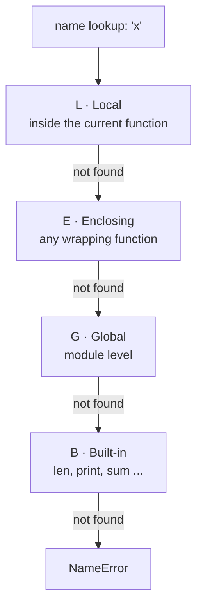

# W1D2 Pre-read — Mon 10 Aug 2026, 11:00 IST

**Topic:** Control flow, loops, functions, arguments, scope, `*args` / `**kwargs`, pure functions

This is a **primer, not the lesson.** Read it once over the weekend, 20 minutes maximum. Its only job is to make sure Monday's 50-minute concept block is spent on the hard parts instead of on vocabulary. Do not try to master this. Do not write code from it yet.

---

## Why this day matters more than it looks

Every model you will ever train is a function. `model.fit(X, y)` is a function call whose argument-passing semantics decide whether your training data gets mutated underneath you. Half of all "why is my result different on the second run" bugs in ML notebooks are scope and mutation bugs, not modelling bugs.

You already know functions from C#. What is genuinely new on Monday:

1. Python has **no method overloading**. One name, one function. Everything C# solves with overloads, Python solves with default arguments and `*args`/`**kwargs`. This is a real design shift, not syntax sugar.
2. Python's scope rules are **LEGB**, resolved at runtime, and there is no block scope. An `if` block does not create a scope. Coming from C#, this will bite you.
3. Default argument values are evaluated **once, at function definition time** — not per call. This is the most famous Python footgun and it interacts directly with everything you learned on Day 1 about mutable objects.

Point 3 is the one to think about before Monday. Given what you learned on Day 1 about `=` rebinding versus methods mutating, predict what this does:

```python
def add_item(item, bucket=[]):
    bucket.append(item)
    return bucket

print(add_item(1))
print(add_item(2))
print(add_item(3))
```

Write your prediction down before Monday. Do not run it. I will ask you for the prediction first and the reason second, and the reason is where the marks are.

---

## Vocabulary to arrive with

You do not need to understand these on Monday. You need to not be surprised by the words.

| Term | Rough meaning | C# thing it is *not quite* like |
|---|---|---|
| Positional argument | matched by order | same |
| Keyword argument | matched by name at the call site | named arguments |
| Default argument | fallback value in the signature | optional parameters — but the evaluation timing differs |
| `*args` | collects extra positional args into a tuple | `params object[]` |
| `**kwargs` | collects extra keyword args into a dict | no clean equivalent |
| Scope | the region where a name resolves | block scope — Python has none |
| `global` / `nonlocal` | explicit escape hatches to write to an outer scope | no equivalent; you rarely need these |
| Pure function | same inputs → same output, no side effects | the thing your unit tests wish you wrote |
| Truthiness in conditions | non-empty / non-zero counts as true | C# requires an actual `bool` |

---

## The one diagram



Note what is **not** on that diagram: `if`, `for`, `while`, and `try` blocks. They do not create scopes. A variable assigned inside a `for` loop is still alive after the loop ends. That is not a bug, it is the design, and Monday's lab will make you exploit it and then get burned by it.

---

## Three questions to bring answers to

Written answers. On Monday I will ask for these before I teach anything, and per the Day 1 pattern I will push back if you answer the first half and stop.

1. Python has no overloading. You need one function that can be called as `train(data)`, `train(data, epochs=10)`, and `train(data, epochs=10, lr=0.01, verbose=True)`. Sketch the signature. What did you give up compared to three C# overloads?
2. A `for` loop variable outlives the loop. Name one place that is convenient and one place it is a genuine hazard.
3. Define "pure function" without using the word "pure". Then say why an ML training loop is almost never one, and what that costs you when you try to reproduce a result.

---

## Monday's shape

| Block | Time IST |
|---|---|
| Concept | 11:00–11:50 |
| Lab | 11:50–13:20 |
| Quiz 2 | 13:20–13:45 |
| Log & commit | 13:45–14:00 |

**Before 11:00 you owe me:** `notes/w1d1-homework-q7-q10.md` filled in and committed, plus the three answers above and the `add_item` prediction. Arrive with those and Monday is a good day. Arrive without them and we spend the concept block on Friday's material instead of Monday's, and Exam 1 on Sat 15 Aug gets harder for you.
